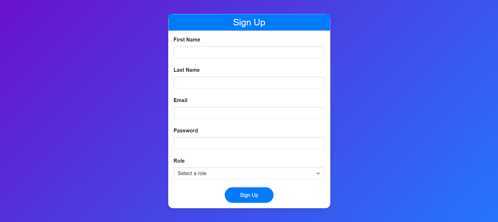

# QuantaComIT Practical Test (SpringBoot)

This project implements a secure employee register system with user authentication and role-based access control.

## Tech Stack

### FrontEnd

✅HTML 
✅CSS 
✅JS 
✅Bootstrap 
✅JQuery 
✅AJAX 

### BackEnd

✅SpringBoot 
✅JWT 
✅MySQL 
✅SpringBoot Data JPA 

## Features

✅Simple Employee Database: Stores employee data including customizable columns. 
✅User Roles: Includes "user" and "admin" roles for differentiated access. 
✅JWT Authentication: Implements secure user login with JWT tokens. 
✅Employee CRUD Operations: Create, Read, Update, and Delete employee data (delete restricted to admins). 
✅Profile Picture Management: Upload profile pictures for employees (stored securely in a designated folder). 
✅Downloadable Profile Picture: Retrieve uploaded profile pictures by employee ID. 
✅Automatic Age Calculation: Calculates and updates an employee's "current_age_in_days" column daily using a scheduled
cron job (birthday required). 
✅Jasper Reports Integration: Generates a downloadable PDF report listing all employees. 

## SignUp

## SignIn

## Employee Management

## Version

1.0.0

⭐️ If you encounter any bugs or issues, or if you have questions about the code, please contact me at: 
[kavithmathushal9007@gmail.com](mailto:kavithmathushal9007@gmail.com)  

#### This project is licensed under the [Apache License](LICENSE)

#### © 2024 All Rights Reserved, Designed By [Kavithma Thushal](https://github.com/Kavithma-Thushal)

